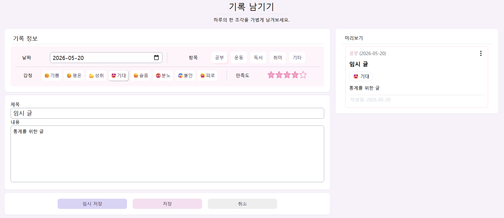
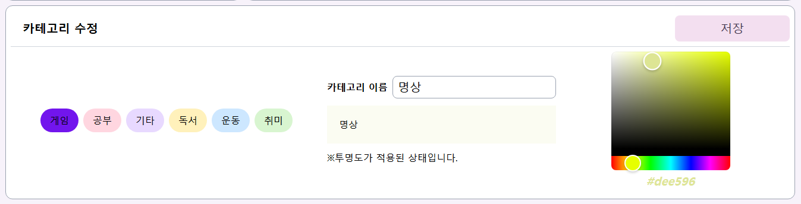
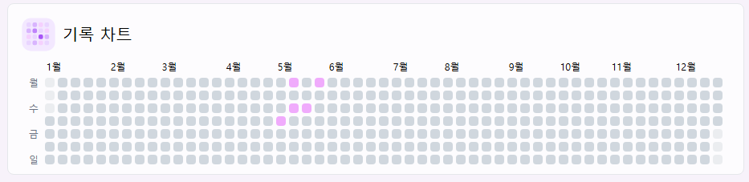
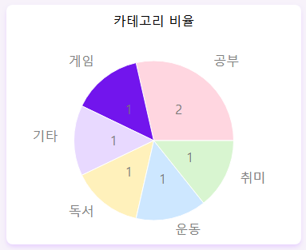
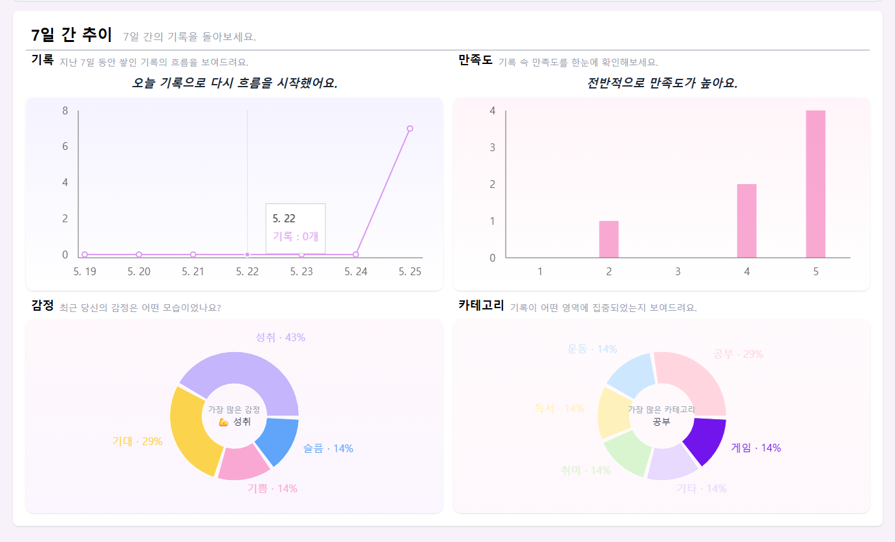
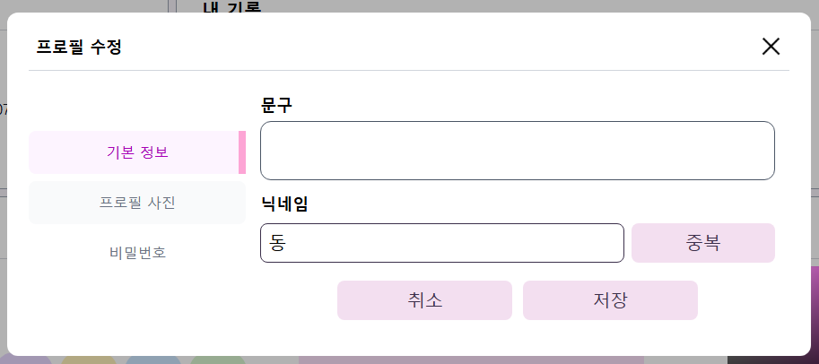
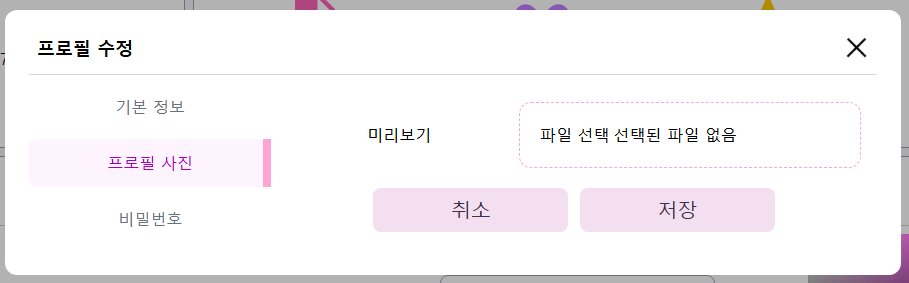
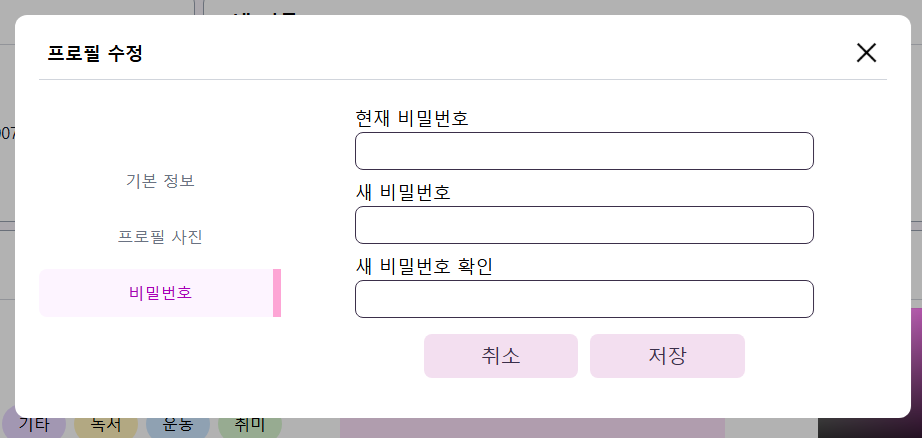

# D.PETAL - 당신의 하루를 기록해보세요.

next.js를 활용한 개인 기록 서비스

## 배포 링크

배포 후 링크 넣을 자리.

## 주요 기능

### 회원가입 / 로그인 / 소셜 로그인

본 서비스는 기록 데이터를 사용자별로 관리하기 때문에 계정 기반 서비스 형태로 구현했다. 

기본적인 회원가입 및 로그인 기능을 구현했고, 추가로 소셜 로그인 기능을 넣어 사용자 편의성을 높였다.

소셜 로그인은 Google, Kakao, Naver, GitHub를 통해 이용할 수 있으며, OAuth 인증 과정을 직접 구현했다.

또한 사용자의 로그인 상태를 유지하기 위해 쿠키 기반 세션 인증을 직접 구현했다.

### 기록 작성

기록 작성은 활동 날짜, 카테고리, 감정, 만족도, 제목, 내용을 작성할 수 있도록 구현했다.

카테고리는 고유한 색상을 가지고 있으며, 해당 색상은 글 목록 및 통계 그래프에서도 동일하게 사용해 사용자가 직관적으로 데이터를 구분할 수 있도록 구현했다.

또한 기록 작성 중 오른 쪽 영역에서 실시간 미리 보기를 통해 결과를 확인할 수 있도록 구현했다. 

현재 이미지에 보이는 임시저장 기능은 UI만 구현된 상태이며, 추후 추가할 예정이다. 

### 카테고리 관리

서비스 특성에 맞게 사용자가 직접 카테고리를 생성할 수 있게 구현했다.

카테고리 이름과 색상은 사용자 별로 고유한 값을 가지도록 설계했으며, 중복 생성이 불가능하도록 UNIQUE 제약 조건을 적용했다.

입력 중인 카테고리 이름과 색상은 실기간 미리보기로 확인할 수 있어 사용자 경험을 개선했다.

색상 선택은 color picker 라이브러리를 활용해 구현했으며, 선택된 색상은 HEX 형식으로 저장된다.

추후 카테고리 수정, 삭제 기능을 추가할 예정이다.  

### 검색 및 조건 필터링
.png)
2.png)

작성한 기록을 카테고리, 날짜, 검색어 기반으로 검색할 수 있도록 구현했다. 

Zustand를 사용해 현재 각각의 필터 상태를 관리했으며, 여러 조건이 동시에 적용된 결과값을 실시간으로 확인할 수 있도록 구현했다. 

또한 선택된 필터 상태를 전역으로 관리해 컴포넌트 간 상태 공유와 UI 동기화를 쉽게 처리할 수 있도록 구현했다.

### 기록 통계 및 시각화

히트맵을 적용해 날짜 기반으로 기록 빈도를 확인할 수 있도록 구현했으며, 특정 날짜를 클릭하면 해당 날짜 기록만 필터링할 수 있도록 구성했다.
 
전체 카테고리 비율은 원형 차트로 시각화했으며, 그래프의 카테고리를 클릭하면 해당 카테고리 기록만 확인할 수 있도록 연동했다. 

또한 기록 요약 상세 페이지에서는 최근 일주일간 작성한 기록의 흐름과 통계를 그래프로 확인할 수 있도록 구현했다. 

### 프로필 관리

개인 정보 수정은 하나의 모달 내부에 탭 구조를 적용해, 원하는 정보를 한 곳에서 수정할 수 있도록 구현했다.

개인 정보에서는 자기소개 문구와 닉네임을 변경할 수 있다.

프로필 이미지는 Cloudinary를 사용해 관리하고 있다.

이미지 파일은 Cloudinary 서버에 저장하고, 데이터베이스에는 이미지 URL만 저장하는 방식으로 구현했다.

이를 통해 서버 저장소 부담을 줄이고, CDN 기반 이미지 제공 및 최적화를 활용할 수 있도록 구성했다.

## 기술 스택

### 프론트엔드
- **Next.js**: App Router 기반 페이지 구성, Route Handler를 활용한 API 구현

- **TypeScript**: 컴포넌트 Props, API 응답, 감정/카테고리 데이터 타입 정의

- **Tailwind CSS**: 반응형 레이아웃 및 UI 스타일링

### 백엔드 & 데이터 베이스
- **Next.js Route Handler**: 로그인, 회원가입, 게시글, 카테고리, 통계 API 구현

- **PostgreSQL**: 사용자, 세션, 카테고리, 게시글 테이블 설계 및 관계형 데이터 관리

### 상태 관리
- **Zustand**: 카테고리, 날짜, 검색어, 페이지네이션 등 클라이언트 필터 상태 관리

- **Tanstack Query**: 게시글, 카테고리, 사용자 정보, 통계 데이터 캐싱 및 서버 상태 관리

### 인증 및 유효성 검사
- **bcrypt**: 비밀번호 해싱

- **Node.js crypto**: 세션 토큰 생성 및 해시 처리

- **Zod**: 회원가입/로그인/프로필 수정 입력값 검증

### 데이터 시각화 및 이미지 처리
- **Recharts**: 카테고리/감정 비율, 만족도 등 통계 차트 구현

- **Cloudinary**: 프로필 이미지 업로드 및 저장